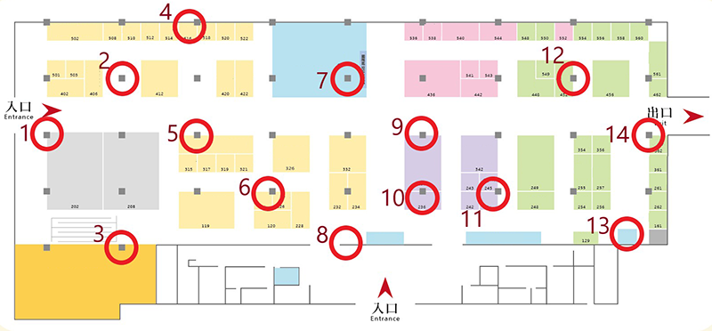

# 馬拉松運動博覽會參訪動線類別預測
## 專案介紹

人潮動線在群眾行為研究中常佔有相當關鍵的影響，不僅僅是行銷活動上的參考重點，也是各種活動、展覽、街邊店面與百貨商城長期關注的資訊。
針對已知類型的群眾樣態，可於舉辦活動或設計攤位上，將分析結果作為依據，進而對其喜好優化，在實際場域的應用上，則可用於辨識群眾與推播適當資訊。

本專案目的為在如此大量的群眾路線組合中，如何訓練與建立出一個良好的決策模型將作是本次議題的挑戰。專案利用Python做資料探勘、數據分析、建立模型與效益評估。實作結果顯示，嘗試過Decision Tree Classifier, XGBoost, Lightgbm模型，最終以XGBoost模型準確率達到96.0%為最優。

## 資料來源

本次資料是由工研院電光所在Aidea(人工智慧共創平台)釋出作為開放性議題，收集來自2018馬拉松博覽會展場的部份抽樣數據，並已整理規劃出五種參訪群眾類型。

資料來源：https://aidea-web.tw/topic/52b87de9-4d20-4d25-9e1e-781a86d77411?lang=en

## 專案步驟：

- 了解資料
- 資料前處理
- 建立模型
- 模型評估

## 了解資料

1. 訓練資料：41,640筆、3個欄位
2. 目標資料：69,592筆、2個欄位
3. 測試資料：20,419筆、3個欄位

## 資料前處理

1. 合併特徵與目標變數
2. 根據時間序列，合併至sniffer01~14
3. 移除ID

## 建立模型

1. 利用10-fold cross-validation方法交叉驗證模型效果
2. 使用Decision Tree Classifier, XGBoost, Lightgbm進行模型評估

## 模型評估

|          模型結構         |  準確率 |
| -------------------------|--------| 
| Decision Tree Classifier | 92.48% |
|          XGBoost         | 96.00% |
|          Lightgbm        | 94.30% |
